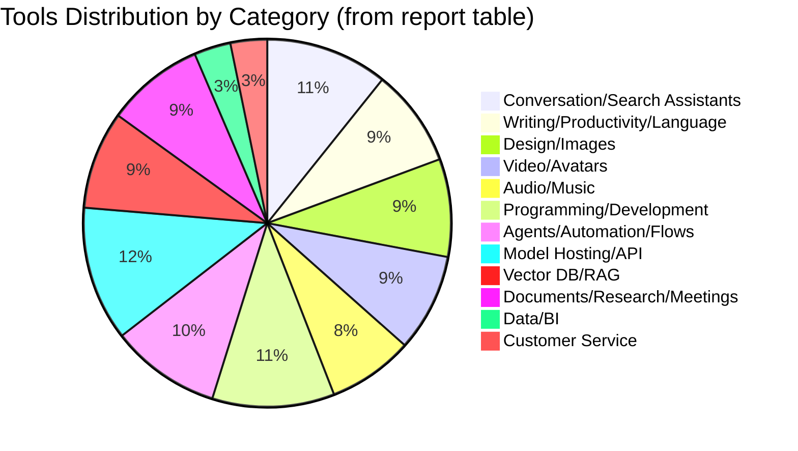
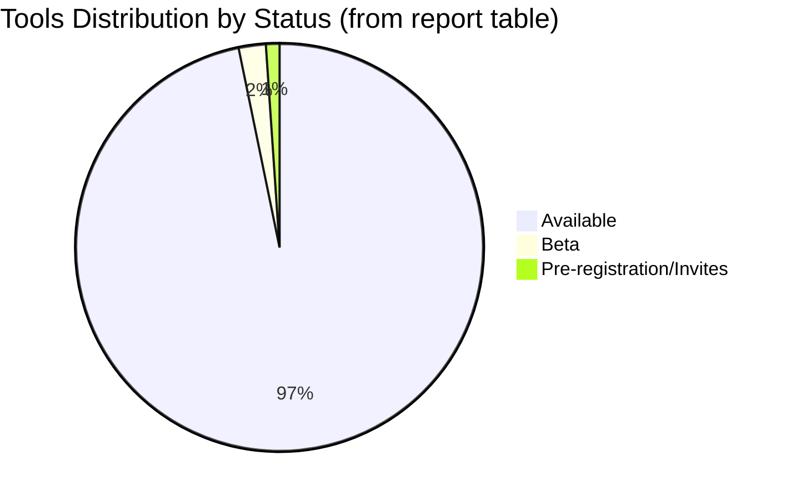

# High-Recall Catalog of Available AI Tools and Announced Tools and Registration Pages

## Executive Summary

The AI tools market online has rapidly become "over-saturated": directories/tool aggregators alone show volumes in the range of **thousands to tens of thousands** of tools (for example: **OpenTools** mentions +10,000 tools with daily updates, **Toolify** mentions +18,000 tools, and **Futurepedia** mentions +6,000 tools with daily updates). citeturn1search0turn1search1turn1search2  
Therefore, "complete coverage" is practically impossible without continuous tracking; however, this report provides a **high-recall catalog** (High-Recall) focused on **quantity** while committing—as much as possible—to primary sources (official product/pricing/documentation pages) and reliable launch channels, with standardized fields and **unspecified** notation when no direct guidance is available.

The catalog below includes **93 tools and platforms** across 12 categories, covering: conversation assistants and research, productivity and writing, image/video/audio generation, development tools, agents and automation, model hosting and API interfaces, vector databases for RAG, documentation and meeting and research tools, as well as data analytics and customer service tools. (All counts and figures are based on the catalog table in this report as of **March 17, 2026**.)

## Methodology and Scope of Coverage

I relied on:
1) **Official/primary sources** as much as possible (pricing pages, documentation, product pages, and registration pages).  
2) **Relatively reliable tool aggregators** as quantitative indicators and trends, while keeping official documentation as reference for truth when available. citeturn1search0turn1search1turn1search2turn1search4turn1search9  
3) Standardizing fields as you requested, and noting **unspecified** when not explicitly mentioned in the source.

Brief field definitions:
- **Status**:  
  - *Available*: Can register/use now (even if with account/region permissions).  
  - *Beta*: Mentioned as beta/gradual launch/experimental features.  
  - *Pre-registration*: Presence of waitlist/invite/notification upon access opening.  
  - *Announced*: Announced without clear availability/registration (did not appear within selected items in this table because I preferred to list tools with clear access/registration page).  
- **Pricing**: Free / Paid / Free+Paid / Unspecified.  
- **Platforms** (abbreviations within table): Web, iOS, Android, Windows, macOS, Linux, API, Browser extension.

image_group{"layout":"carousel","aspect_ratio":"1:1","query":["ChatGPT logo","Claude Anthropic logo","Google Gemini logo","Microsoft Copilot logo","Perplexity AI logo","Midjourney logo","Adobe Firefly logo","Runway logo"],"num_per_query":1}

## Tools Catalog

Note: Links are shown in code format (like `example.com`) to be copyable, while citations (cite…) link to the source proving the page/information.

### Comprehensive Table

| Tool (Name/Transliteration) | Primary Category | Brief Description | Official Site/Registration | Status + Pricing | Languages/Platforms | Integrations / APIs | Company/Entity | Date (if found) |
|---|---|---|---|---|---|---|---|---|
| ChatGPT (Chat GPT) | Conversation Assistant/Multi-modal | General conversation, writing, and analysis assistant with multiple subscription tiers depending on plan. citeturn2search0 | `chatgpt.com` citeturn2search0 | Available; Free+Paid citeturn2search0 | Web; (Languages: Unspecified) | API: `platform.openai.com` citeturn14search5turn20search14 | OpenAI | Unspecified |
| Claude (Claude) | Conversation Assistant/Research | Conversation assistant with free and paid plans (Pro and others) including additional features. citeturn21search6 | `claude.com` citeturn21search6 | Available; Free+Paid citeturn21search6 | Web; (Languages: Unspecified) | Claude API: `api.claudia.ai` citeturn21search2 | Anthropic | Unspecified |
| Gemini (Gemini) | Conversation Assistant/Multi-modal | Google's conversation and task assistant with subscription plans (such as AI Pro/Ultra depending on country). citeturn2search2 | `gemini.google.com` citeturn2search2 | Available; Free+Paid citeturn2search2 | Web; (Languages: Unspecified) | Google ecosystem integrations (Unspecified in detail here) | Google | Unspecified |
| Microsoft Copilot (Copilot) | Conversation Assistant/Productivity | Microsoft's conversation and task assistant, with official plans and pricing. citeturn2search1 | `copilot.microsoft.com` citeturn2search1 | Available; Free+Paid citeturn2search1 | Web; (Languages: Unspecified) | Microsoft integrations (Unspecified) | Microsoft | Unspecified |
| Perplexity (Perplexity) | Search/Answers with Sources | AI-powered answer/search engine with Pro/Enterprise plans. citeturn3search12turn3search8turn3search4 | `perplexity.ai` citeturn3search12 | Available; Free+Paid citeturn3search8 | Web; (Languages: Unspecified) | Enterprise features/integrations (Unspecified) | Perplexity AI | Unspecified |
| Grok (Grok) | Conversation Assistant/Search | xAI assistant with subscription plans (SuperGrok) and developer model/pricing documentation. citeturn3search5turn3search1 | `grok.com` citeturn3search5 | Available; Free+Paid citeturn3search5 | Web; (Languages: Unspecified) | xAI Developers: `docs.x.ai` citeturn3search1 | xAI | Unspecified |
| Meta AI (Meta AI) | Conversation Assistant/Image Generation | Meta assistant with "free" image creation according to product page. citeturn3search3 | `meta.ai` citeturn3search3 | Available; Free/Unspecified citeturn3search3 | Web; (Languages: Unspecified) | (APIs: Unspecified) | Meta | Unspecified |
| Le Chat (Le Chat) | Conversation Assistant | Mistral assistant with "Try for free" and official pricing plans. citeturn3search6turn3search2 | `chat.mistral.ai` citeturn3search10 | Available; Free+Paid citeturn3search2 | Web + Apps (App Store/Google Play mentioned on page) citeturn3search6 | Mistral AI Studio/Integrations (Unspecified) | Mistral AI | Unspecified |
| Brave Leo (Leo) | In-Browser Assistant | Assistant built into Brave browser with Premium plan and monthly/annual fees. citeturn30search7turn30search3 | `brave.com/leo` citeturn30search7 | Available; Free+Paid citeturn30search3 | Browser (Brave); (Languages: Unspecified) | (APIs: Unspecified) | Brave | Unspecified |
| Poe (Poe) | Model Aggregator/Conversation | Platform aggregating multiple models "thousands" within one interface and subscription/points plans. citeturn30search16turn30search0 | `poe.com` citeturn30search16 | Available; Free+Paid citeturn30search0 | Web; (Languages: Unspecified) | (APIs: Unspecified) | Quora | Unspecified |
| Notion (Notion) | Productivity + Agents/Automation | Work platform including "Custom Agents" feature with Credits pricing (mentioned) and Beta status. citeturn11search0 | `notion.com/pricing` citeturn11search0 | Beta (Custom Agents); Free+Paid citeturn11search0 | Web; (Languages: Unspecified) | "Connected apps" integrations (Unspecified) | Notion | Unspecified |
| Grammarly (Grammarly) | Writing/Proofreading/Text Generation | Writing assistant with free plan and paid plans (Pro) including free trial. citeturn11search1turn11search5 | `grammarly.com/plans` citeturn11search1 | Available; Free+Paid citeturn11search1 | Web/Extensions (Unspecified in detail) | (APIs: Unspecified) | Grammarly | Unspecified |
| Jasper (Jasper) | Writing and Marketing | Platform/agents for marketing with official pricing page and trial. citeturn11search6turn11search2 | `jasper.ai/pricing` citeturn11search2 | Available; Paid (with trial) citeturn11search2 | Web; (Languages: Unspecified) | (API: Unspecified) | Jasper | Unspecified |
| Copy.ai (Copy.ai) | Marketing/Sales Automation | GTM AI platform with "Workflows" and published enterprise pricing. citeturn11search7turn11search3 | `copy.ai/prices` citeturn11search3 | Available; Paid/Unspecified (Free: Unspecified) | Web; (Languages: Unspecified) | (API/Integrations mentioned within platform) citeturn11search3 | Copy.ai | Unspecified |
| DeepL (DeepL) | Translation/Language | Translation platform with DeepL Agent and API interface and DeepL Pro plans. citeturn25search4turn25search0turn25search16 | `deepl.com/en` citeturn25search4 | Available; Free+Paid citeturn25search0 | Web; (Number of languages: 100+ mentioned on translator) citeturn25search12 | DeepL API: `deepl.com/en/pro-api` citeturn25search16 | DeepL | Unspecified |
| QuillBot (QuillBot) | Paraphrasing/Rewriting | Writing tools suite including paraphrasing and summarization with Premium plan. citeturn25search13turn25search1 | `quillbot.com/upgrade` citeturn25search1 | Available; Free+Paid citeturn25search5 | Web; (Languages: Unspecified) | (APIs: Unspecified) | QuillBot | Unspecified |
| Wordtune (Wordtune) | Writing/Text Enhancement | Writing assistant with official plans and pricing page. citeturn25search10turn25search2 | `wordtune.com/plans` citeturn25search2 | Available; Free+Paid citeturn25search2 | Web/Extensions (Unspecified in detail) | (APIs: Unspecified) | (Company: Unspecified) | Unspecified |
| Writesonic (Writesonic) | Writing/SEO + ChatGPT Visibility Tracking | Content/SEO platform with official pricing. citeturn25search11turn25search3 | `writesonic.com/pricing` citeturn25search3 | Available; Paid (Free: Unspecified) | Web; (Languages: Unspecified) | (API mentioned in documentation) citeturn25search7 | Writesonic | Unspecified |
| Midjourney (Midjourney) | Image Generation | Image generator with detailed official pricing plans in documentation. citeturn4search4turn4search0 | `midjourney.com` citeturn4search4 | Available; Paid citeturn4search0 | Web/Discord (mentioned in documentation) | (API: Unspecified) | Midjourney | Unspecified |
| Adobe Firefly (Adobe Firefly) | Image/Video/Audio Generation | Generation/editing tools for "images/video/audio" with Firefly plans and "Free plan" details. citeturn4search9turn4search1turn14search3 | `adobe.com/products/firefly.html` citeturn4search9 | Available; Free+Paid citeturn4search9turn4search1 | Web/Desktop/Mobile (mentioned) citeturn4search9 | Partner model integrations/partnerships mentioned | Adobe | Unspecified |
| Stability AI Stable Image (Stable Image) | Image Generation | Stable Diffusion/Stable Image models with licensing/options mentioned. citeturn4search6 | `stability.ai/stable-image` citeturn4search6 | Available; Unspecified | Web (licensing information) | (API/Licensing: mentioned) citeturn4search6 | Stability AI | Unspecified |
| Ideogram (Ideogram) | Image Generation | Image generator from text via ideogram.ai. citeturn4search3 | `ideogram.ai` citeturn4search3 | Available; Unspecified | Web; (Languages: Unspecified) | (API: Unspecified) | Ideogram | Unspecified |
| Canva Magic Studio (Canva Magic Studio) | Design + AI Tools | AI tools package within Canva (Magic Studio). citeturn23search4 | `canva.com/magic` citeturn23search4 | Available; Free+Paid citeturn23search0 | Web (and typical Canva apps); (Languages: Unspecified) | (Integrations: Unspecified) | Canva | Unspecified |
| Leonardo AI (Leonardo AI) | Image/Video Creative Generation | Creative asset generation platform with pricing and free/paid plans, plus API. citeturn27search8turn27search0turn27search16 | `leonardo.ai/pricing` citeturn27search0 | Available; Free+Paid citeturn27search0 | Web; (Languages: Unspecified) | Leonardo API: `leonardo.ai/api` citeturn27search16 | Leonardo.Ai | Unspecified |
| Krea (Krea) | Creative Tools/Images/Video/3D | Asset generation and editing suite (images/video/3D) with pricing page. citeturn27search5turn27search1 | `krea.ai/pricing` citeturn27search1 | Available; Free+Paid citeturn27search1 | Web; (Languages: Unspecified) | (API: Unspecified) | Krea AI | Unspecified |
| Recraft (Recraft) | Image Generation + Vector | Image and vector (SVG) generation platform with pricing page and API interface. citeturn27search6turn27search2turn27search10 | `recraft.ai/pricing` citeturn27search2 | Available; Free+Paid citeturn27search2 | Web; (Languages: Unspecified) | Recraft API (mentioned) citeturn27search10 | Recraft | Unspecified |
| Black Forest Labs FLUX (FLUX) | Image Generation (Models) | FLUX lab/models for image generation with "Try FLUX.2 for free" on page. citeturn27search3 | `bfl.ai` citeturn27search3 | Available; Free+Paid/Unspecified citeturn27search3 | Web; (Languages: Unspecified) | API/Licensing (mentioned) citeturn27search15 | Black Forest Labs | Unspecified |
| Sora (Sora) | Video Generation | Video generator from OpenAI; product page exists and "Sora 2" page discusses notification upon access opening/gradual launch. citeturn14search0turn14search1 | `openai.com/sora` citeturn14search0 | Beta/Gradual Launch; Pricing Unspecified (linked to OpenAI account) citeturn14search1turn14search14 | Web + iOS (mentioned) citeturn14search1 | (Linked to OpenAI account) citeturn14search12 | OpenAI | Unspecified |
| Veo 3 (Veo 3) | Video Generation | Video model from Google DeepMind/AI Studio with model page requiring registration/login. citeturn14search2turn14search6 | `aistudio.google.com/models/veo-3` citeturn14search2 | Available; Unspecified | Web | API/AI Studio (within Google) citeturn14search2 | Google | Unspecified |
| Runway (Runway) | Video/Image/Audio Generation | Video generation platform with pricing page and API options for developers. citeturn5search4turn5search0turn5search8 | `runwayml.com/pricing` citeturn5search0 | Available; Free+Paid citeturn5search0 | Web; (Languages: Unspecified) | Runway API (Credits) citeturn5search8 | Runway | Unspecified |
| Pika (Pika) | Video Generation | Video generation platform with free and paid plans. citeturn5search5turn5search1 | `pika.art/pricing` citeturn5search1 | Available; Free+Paid citeturn5search1 | Web; (Languages: Unspecified) | (API: Unspecified) | Pika Labs | Unspecified |
| Luma Dream Machine (Luma Dream Machine) | Video Generation | Video generator (Dream Machine) with pricing page (Plus/Pro/Ultra) and mention of "Luma Agents". citeturn5search10turn5search6 | `lumalabs.ai/pricing` citeturn5search6 | Available; Free+Paid citeturn5search6 | Web; (and iOS mentioned in plans) citeturn5search2 | (Integrations: Unspecified) | Luma AI | Unspecified |
| Synthesia (Synthesia) | Business Avatar Video | Business video platform with official pricing page. citeturn5search7turn5search3 | `synthesia.io/pricing` citeturn5search3 | Available; Free+Paid citeturn5search3 | Desktop (mentioned) citeturn5search3 | (API/Integrations: Unspecified) | Synthesia | Unspecified |
| HeyGen (HeyGen) | Avatar Video + API | Avatar video platform with free plan and limits and Creator billing and others, plus API pricing. citeturn14search4turn14search8 | `heygen.com/pricing` citeturn14search4 | Available; Free+Paid citeturn14search4 | Web; (Languages: Unspecified) | HeyGen API (mentioned) citeturn14search8 | HeyGen | Unspecified |
| D-ID (D-ID) | Avatar Video/Visual Agents | Video/visual agents platform with Studio and API pricing, and mentions support for 120+ languages. citeturn23search9turn23search3turn23search6 | `d-id.com/pricing/studio` citeturn23search3 | Available; Free+Paid (trial) citeturn23search6 | Web/Mobile (mentioned) citeturn23search3 | D-ID API (mentioned) citeturn23search6 | D-ID | Unspecified |
| ElevenLabs (ElevenLabs) | TTS + Voice Agents | Realistic audio generation and voice agents with official pricing and mention of "70+ languages". citeturn6search17turn6search0 | `elevenlabs.io/pricing` citeturn6search0 | Available; Free+Paid citeturn6search0 | Web + API; (70+ languages) citeturn6search17 | API/SDK (mentioned) citeturn6search4 | ElevenLabs | Unspecified |
| Deepgram (Deepgram) | STT/TTS + Voice Agent API | Audio platform with STT/TTS/Voice Agent API interfaces with $200 starting credit. citeturn6search5turn6search1 | `deepgram.com/pricing` citeturn6search1 | Available; Free+Paid citeturn6search1 | API | Voice Agent API (mentioned) citeturn6search1turn6search5 | Deepgram | Unspecified |
| AssemblyAI (AssemblyAI) | STT/Audio Understanding | Voice AI platform for audio transcription and speech understanding with official pricing page. citeturn6search9turn6search2 | `assemblyai.com/pricing` citeturn6search2 | Available; Free+Paid citeturn6search2 | API | STT models and understanding features (mentioned) citeturn6search9 | AssemblyAI | Unspecified |
| Suno (Suno) | Music Generation | Music generator with free plan and paid plans with usage details. citeturn6search7turn6search3 | `suno.com/pricing` citeturn6search3 | Available; Free+Paid citeturn6search3 | Web; (Languages: Unspecified) | (API: Unspecified) | Suno | Unspecified |
| Udio (Udio) | Music Generation | Music generator with official pricing page. citeturn28search4turn28search0 | `udio.com/pricing` citeturn28search0 | Available; Free+Paid citeturn28search0 | Web | (API: Unspecified) | Udio | Unspecified |
| Murf (Murf) | TTS | Audio generation/voice agents (Murf Falcon) with pricing page. citeturn28search5turn28search1 | `murf.ai/pricing` citeturn28search1 | Available; Free+Paid citeturn28search1 | Web + API (mentioned "Get API Key") citeturn28search5 | TTS API (mentioned) citeturn28search5 | Murf AI | Unspecified |
| Resemble AI (Resemble AI) | Voice cloning + Deepfake Detection | Audio generation and voice cloning and Deepfake detection with "Flex plan" pricing. citeturn28search7turn28search3 | `resemble.ai/pricing` citeturn28search3 | Available; Free+Paid citeturn28search3 | Web + API | Full API access (mentioned) citeturn28search3 | Resemble AI | Unspecified |
| GitHub Copilot (GitHub Copilot) | Programming Assistant | Code writing assistant within editor with documented Copilot plans. citeturn7search0turn7search4 | `github.com/features/copilot/plans` citeturn7search0 | Available; Free+Paid citeturn7search4 | IDEs (Unspecified in detail) | GitHub/IDE Extensions integration (mentioned) citeturn7search0 | GitHub / Microsoft | Unspecified |
| Cursor (Cursor) | AI Assistant IDE | Editor/IDE with plans including Agents and mention of MCPs and Cloud agents. citeturn7search5turn7search1 | `cursor.com/pricing` citeturn7search1 | Available; Free+Paid citeturn7search1 | macOS (mentioned for download); (Other platforms: Unspecified here) citeturn7search5 | Multiple model integration + MCPs (mentioned in pricing) citeturn7search1 | Cursor | Unspecified |
| Windsurf (Windsurf) | IDE/Agentic IDE | "Windsurf Editor" as agent-enabled IDE available on Mac/Windows/Linux. citeturn9search16 | `windsurf.com/editor` citeturn9search16 | Available; Free+Paid citeturn7search2turn9search0 | Mac/Windows/Linux citeturn9search16 | (MCP/Extensions mentioned within context) citeturn9search16 | Windsurf | Unspecified |
| Replit Agent (Replit Agent) | Building Apps by Description | Agent that builds applications/websites via conversation, with official pricing (Starter/Core…). citeturn8search13turn8search1 | `replit.com/ai` citeturn8search13 | Available; Free+Paid citeturn8search1 | Web | Deployment/hosting integration within Replit (mentioned) citeturn8search1turn8search9 | Replit | Unspecified |
| Amazon Q Developer (Amazon Q Developer) | Programming Assistant | Development assistant from AWS with Free tier and/or Pro with documented pricing. citeturn7search15turn7search3 | `aws.amazon.com/q/developer/` citeturn7search15 | Available; Free+Paid citeturn7search15turn7search3 | (Platforms: Unspecified) | Deep AWS integration (mentioned) citeturn7search15 | Amazon Web Services | Unspecified |
| JetBrains AI Assistant (JetBrains AI) | IDE Assistant | AI Pro/Ultimate plans within JetBrains IDEs with official pricing. citeturn9search1turn9search5 | `jetbrains.com/ai-ides/buy/` citeturn9search1 | Available; Paid (with trial) citeturn9search5 | Within IDEs (Windows/macOS/Linux per product) | (Integrations: Unspecified) | JetBrains | February 17, 2026 (licensing/subscription page) citeturn9search5 |
| Gemini Code Assist (Gemini Code Assist) | Programming Assistant | Google's programming assistant with pricing/subscription and business options. citeturn9search2turn9search22turn9search10 | `codeassist.google` citeturn9search2 | Available; Free+Paid citeturn9search2turn9search22 | IDE extensions (Unspecified) | Cloud/Business pricing mentioned citeturn9search22turn9search10 | Google | Unspecified |
| Aider (Aider) | CLI Programming Assistant | "AI pair programming in your terminal" with Git integration (Auto commits). citeturn29search1 | `github.com/Aider-AI/aider` citeturn29search1 | Available; Free (Open Source) citeturn29search1 | CLI (system-dependent) | Connects to multiple models (Unspecified here) | Community/Open Source | Unspecified |
| Cline (Cline) | Coding Agent within VS Code | Agent extension capable of running CLI/editing files/browser with MCP mention. citeturn29search2 | `github.com/cline/cline` citeturn29search2 | Available; Free (Open Source) citeturn29search2 | VS Code | MCP + model providers (mentioned) citeturn29search2 | Community/Open Source | Unspecified |
| Devin (Devin) | "Software Engineer" Agent | Development agent from Cognition; noted as "early access" with waitlist/invite. citeturn29search3turn29search9 | `devin.ai` citeturn29search3 | Pre-registration/Invites; Pricing Unspecified citeturn29search9 | Web | Slack/Teams/Linear/Jira integrations mentioned. citeturn29search3 | Cognition | March 12, 2024 (introducing devin announcement) citeturn29search9 |
| Zapier (Zapier) | Automation/Integrations | "Zaps" automation platform with free plan and mention of "Start automating with AI". citeturn15search0 | `zapier.com/pricing` citeturn15search0 | Available; Free+Paid citeturn15search0 | Web | Multiple Apps integrations (Zapier core) | Zapier | Unspecified |
| Make (Make) | Visual Automation/Agents | "visual-first" flow/agents building platform with free plan and Credits pricing. citeturn15search14turn15search1 | `make.com/en/pricing` citeturn15search1 | Available; Free+Paid citeturn15search1 | Web | Multiple integrations (mentioned) citeturn15search14 | Make | Unspecified |
| n8n (n8n) | Automation/Programmable Agents | Automation platform integrating AI, with execution-based pricing and self-hosted version. citeturn15search8turn15search2 | `n8n.io/pricing` citeturn15search2 | Available; Free+Paid citeturn15search2 | Web/Cloud + Self-hosted | "every integration" integrations mentioned citeturn15search2 | n8n | Unspecified |
| UiPath (UiPath) | Enterprise Automation/Agentic Automation | Automation platform with "agentic automation" mention and pricing starting from Basic. citeturn15search9turn15search3 | `uipath.com/pricing` citeturn15search3 | Available; Paid (and some trials) citeturn15search3 | Web/Cloud (and applications/Robots) | Integrations/Platform (Unspecified) | UiPath | Unspecified |
| OpenAI Agents (OpenAI Agents) | Building Agents/Agents SDK | Official guides for building, deploying, and improving Agents and related SDK. citeturn20search3turn20search7 | `developers.openai.com/api/docs/guides/agents/` citeturn20search3 | Available; Unspecified (depends on API usage) | API/SDK | Agents SDK Python/TS (mentioned) citeturn20search7 | OpenAI | Unspecified |
| OpenAI Agent Builder (Agent Builder) | Building Multi-Step Flow Visually | "Visual canvas" for building multi-step flows in Playground. citeturn20search11 | `developers.openai.com/api/docs/guides/agent-builder/` citeturn20search11 | Available; Unspecified | Web | Outputs SDK code/ChatKit (mentioned) citeturn20search11 | OpenAI | Unspecified |
| AutoGen (AutoGen) | Multi-Agent Framework | Microsoft framework for multi-agent applications. citeturn20search0turn20search4 | `github.com/microsoft/autogen` citeturn20search0 | Available; Free (Open Source) citeturn20search0 | Python (mentioned) citeturn20search4 | (Integrations: Unspecified) | Microsoft | Unspecified |
| Microsoft Agent Framework (Microsoft Agent Framework) | Agent Framework | Framework for building/orchestrating/deploying multiple agents with Python/.NET support. citeturn20search8 | `github.com/microsoft/agent-framework` citeturn20search8 | Available; Free (Open Source) citeturn20search8 | Python/.NET citeturn20search8 | (Integrations: Unspecified) | Microsoft | Unspecified |
| CrewAI (CrewAI) | Multi-Agent Framework | Python framework for organizing "role-playing/autonomous" agents with official documentation. citeturn20search1turn20search12 | `docs.crewai.com` citeturn20search12 | Available; Free (Open Source) citeturn20search1 | Python | Tools/Integrations (CrewAI tools) citeturn20search15 | CrewAI | Unspecified |
| Dify (Dify) | LLMOps/Building AI Applications | Agentic/LLMOps platform with official pricing page, and notes it is open source. citeturn36search4turn36search0 | `dify.ai/pricing` citeturn36search0 | Available; Free+Paid citeturn36search4turn36search0 | Web; (Languages: Unspecified) | (Integrations: Unspecified) | Dify | Unspecified |
| OpenAI API (OpenAI APIs) | Model Hosting/API Interfaces | Official API pricing page including embeddings and others. citeturn21search0turn21search4turn22search5 | `openai.com/api/pricing` citeturn21search4 | Available; Pay-as-you-go/Paid citeturn21search4 | API | Embeddings/Images and others citeturn21search0turn21search4 | OpenAI | March 31, 2026 (container usage billing change) citeturn22search5 |
| Anthropic API (Anthropic APIs) | Model Hosting/API Interfaces | Claude API pricing (within Claude documentation). citeturn21search2 | `api.anthropic.com/docs/about-claude/pricing` citeturn21search2 | Available; Pay-as-you-go/Paid citeturn21search2 | API | (Integrations: Unspecified) | Anthropic | Unspecified |
| Cohere (Cohere) | Models/Embedding/Rerank | Official pricing for Cohere products. citeturn21search1 | `cohere.com/pricing` citeturn21search1 | Available; Paid/Pay-as-you-go citeturn21search1 | API | Embed (mentioned) citeturn21search13 | Cohere | Unspecified |
| Mistral AI Pricing (Mistral) | Models/Studio/Le Chat | Official pricing page for Le Chat/Mistral AI Studio. citeturn3search2 | `mistral.ai/pricing` citeturn3search2 | Available; Free+Paid citeturn3search2 | Web + Services | (API/Studio: Unspecified) | Mistral AI | Unspecified |
| xAI Developers (xAI Developers) | Models/API Interfaces | "Models and Pricing" documentation for Grok models via developer interface. citeturn3search1 | `docs.x.ai/developers/models` citeturn3search1 | Available; Paid/Pay-as-you-go citeturn3search1 | API | Function calling/Structured outputs (mentioned) citeturn3search1 | xAI | Unspecified |
| Hugging Face (Hugging Face) | Model Hosting/Inference Endpoints | Official pricing for Inference Endpoints and others on Hugging Face. citeturn10search0turn10search4turn10search12 | `huggingface.co/pricing` citeturn10search0 | Available; Free+Paid citeturn10search12 | Web + API | Inference Endpoints/Providers citeturn10search4 | Hugging Face | Unspecified |
| Replicate (Replicate) | Running Models via API | Official "pay by time / per input-output" pricing to run multiple models via API. citeturn10search5turn10search1turn10search17 | `replicate.com/pricing` citeturn10search1 | Available; Paid (with trials/try for free) citeturn10search13 | API | Community models + private models (mentioned) citeturn10search1 | Replicate | Unspecified |
| Together AI (Together AI) | Inference + Fine-tuning + GPUs | Official pricing for inference services (Chat/Vision/Embeddings…) and others. citeturn10search2 | `together.ai/pricing` citeturn10search2 | Available; Free+Paid citeturn10search2 | API | OpenAI-compatible API (mentioned in analytics) citeturn10search18 | Together AI | Unspecified |
| GroqCloud (GroqCloud) | Fast Inference | Groq pricing and GroqCloud plans (Free/Developer…). citeturn10search11turn10search3 | `groq.com/groqcloud` citeturn10search11 | Available; Free+Paid citeturn10search11 | API | (Integrations: Unspecified) | Groq | Unspecified |
| Amazon Bedrock (Bedrock) | Model Hosting (AWS) | Foundation models platform on AWS with pricing depending on provider/model/tier. citeturn22search8turn22search0 | `aws.amazon.com/bedrock/pricing/` citeturn22search0 | Available; Pay-as-you-go/Paid citeturn22search0 | API (AWS) | Multiple models + evaluations (mentioned) citeturn22search8 | AWS | Unspecified |
| Azure OpenAI Service (Azure OpenAI) | Model Hosting (Microsoft) | Official pricing for Azure OpenAI (PAYG and PTUs). citeturn22search1 | `azure.microsoft.com/pricing/details/azure-openai/` citeturn22search1 | Available; Pay-as-you-go/Paid citeturn22search1 | API (Azure) | (Integrations: Unspecified) | Microsoft Azure | Unspecified |
| Vertex AI Generative AI (Vertex AI) | Model Hosting (Google Cloud) | Generative AI pricing on Vertex AI. citeturn22search2 | `cloud.google.com/vertex-ai/generative-ai/pricing` citeturn22search2 | Available; Pay-as-you-go/Paid citeturn22search2 | API (GCP) | Partner models (mentioned) citeturn22search2 | Google Cloud | Unspecified |
| IBM watsonx.ai (Watson X) | Model Hosting/Embeddings | watsonx.ai pricing (Trial/Essentials/Standard) with sections for models/Embeddings. citeturn22search3 | `ibm.com/products/watsonx-ai/pricing` citeturn22search3 | Available; Free+Paid citeturn22search3 | Web + API (depends on product) | (Integrations: Unspecified) | IBM | Unspecified |
| Pinecone (Pinecone) | Vector DB/RAG | Vector database with usage-based pricing and monthly minimum. citeturn12search4turn12search0 | `pinecone.io/pricing` citeturn12search0 | Available; Free+Paid citeturn12search4turn12search0 | API | (Integrations: Unspecified) | Pinecone | Unspecified |
| Weaviate (Weaviate) | Vector DB/RAG | Weaviate database/cloud with pricing page including "Weaviate Query Agent". citeturn12search9turn12search1 | `weaviate.io/pricing` citeturn12search1 | Available; Free+Paid citeturn12search1 | API | Query Agent (mentioned) citeturn12search1 | Weaviate | Unspecified |
| Qdrant (Qdrant) | Vector DB/RAG | Qdrant Cloud with resource-dependent pricing with Free tier. citeturn12search6turn12search2 | `qdrant.tech/pricing` citeturn12search2 | Available; Free+Paid citeturn12search2 | API | (Integrations: Unspecified) | Qdrant | Unspecified |
| Zilliz Cloud (Zilliz Cloud) | Vector DB (Milvus managed) | Zilliz Cloud (managed built on Milvus) with free plan. citeturn12search7turn12search3 | `zilliz.com/pricing` citeturn12search3 | Available; Free+Paid citeturn12search3 | API | LangChain/LlamaIndex etc. integrations (mentioned in market listing) citeturn12search15 | Zilliz | Unspecified |
| Milvus (Milvus) | Vector DB (Open Source) | Open source vector database with "Try Managed Milvus". citeturn12search19 | `milvus.io` citeturn12search19 | Available; Free (OSS) / Paid (Managed) | (Platforms: Unspecified) | (Integrations: Unspecified) | LF AI & Data/Community | Unspecified |
| Chroma (Chroma) | Vector DB/RAG | Search/retrieval open source database with products/pricing and Cloud option. citeturn32search0turn32search4 | `trychroma.com` citeturn32search0 | Available; Free+Paid citeturn32search4 | Web + multiple client libraries (Cookbook) citeturn32search8 | Chroma Cloud (mentioned) citeturn32search4 | Chroma | Unspecified |
| pgvector (pgvector) | Vector extension / RAG | Postgres extension for vector search, open source. citeturn32search2 | `github.com/pgvector/pgvector` citeturn32search2 | Available; Free (OSS) citeturn32search2 | Postgres | (Integrations: Unspecified) | Community | November 11, 2024 (0.8.0 release per PostgreSQL news) citeturn32search6 |
| OpenSearch Vector Engine (OpenSearch) | Vector search engine | Vector engine for building scalable AI applications (OpenSearch). citeturn33search1turn33search5 | `opensearch.org/platform/vector-engine/` citeturn33search1 | Available; Free (OSS) citeturn33search1 | Web/Servers | (Integrations: Unspecified) | OpenSearch Project / Linux Foundation | Unspecified |
| LlamaIndex / LlamaParse (LlamaIndex) | RAG/Documents/OCR | Platform/framework "document agents" with LlamaParse and free plan (credits). citeturn13search1turn13search5 | `llamaindex.ai` citeturn13search1 | Available; Free+Paid citeturn13search1 | Web + SDKs (Unspecified) | LlamaParse/Integrations (Unspecified) | LlamaIndex | Unspecified |
| Unstructured (Unstructured) | Data Processing/Documents for GenAI | Processing unstructured data into ready-to-use RAG inputs with per-page pricing. citeturn31search11turn31search3 | `unstructured.io/pricing` citeturn31search3 | Available; Free+Paid citeturn31search3 | Web + API | Connectors/Strategies (mentioned) citeturn31search3 | Unstructured | Unspecified |
| ChatPDF (ChatPDF) | Conversation with PDFs | Conversation with PDF files with free plan and daily limit. citeturn31search0 | `chatpdf.com` citeturn31search0 | Available; Free+Paid citeturn31search0 | Web | (Integrations: Unspecified) | ChatPDF | Unspecified |
| Humata (Humata) | Conversation/Document Extraction | Document conversation and understanding with pricing starting from Free up to Teams plans. citeturn31search5turn31search1 | `humata.ai/pricing` citeturn31search1 | Available; Free+Paid citeturn31search1 | Web | (SSO coming mentioned) citeturn31search5 | Humata | Unspecified |
| Otter (Otter) | Meeting Transcription/Summarization | AI Notetaker with Zoom/Teams/Meet integration and pricing plans. citeturn17search4turn17search0 | `otter.ai/pricing` citeturn17search0 | Available; Free+Paid citeturn17search0 | Web + iOS/Android (mentioned) citeturn17search0 | Zapier integration mentioned citeturn17search0 | Otter.ai | Unspecified |
| Fireflies.ai (Fireflies) | Meeting Summarization/Conversation Intelligence | AI Notetaker across meeting platforms with pricing page and API. citeturn17search5turn17search1 | `fireflies.ai/pricing` citeturn17search1 | Available; Free+Paid citeturn17search1 | Web/Apps (mentioned) citeturn17search1 | API (mentioned) citeturn17search1 | Fireflies.ai | Unspecified |
| Zoom AI Companion (Zoom AI) | Meeting Assistant/Productivity | AI assistant from Zoom "included at no additional cost" within qualifying paid services. citeturn17search7turn17search11 | `zoom.com/products/ai-assistant/` citeturn17search7 | Available; Unspecified (tied to paid plans) citeturn17search7 | Zoom Workplace | (Integrations: Unspecified) | Zoom | Unspecified |
| Elicit (Elicit) | Research/Paper Reviews | Research assistant mentioning search across 100M+ papers with pricing plans. citeturn26search4turn26search0 | `elicit.com/pricing` citeturn26search0 | Available; Free+Paid citeturn26search0 | Web; (Languages: Unspecified) | Zotero integration mentioned citeturn26search0 | Elicit | Unspecified |
| Snowflake Cortex Search (Snowflake) | Data/Search/RAG Costs | Official pages explaining Cortex Search costs (Cloud Services compute) and AI SQL functions. citeturn16search0turn16search8 | `docs.snowflake.com/.../cortex-search-costs` citeturn16search0 | Available; Paid (within Snowflake) citeturn16search0 | SaaS | AI SQL/Document AI billing (mentioned) citeturn16search8 | Snowflake | Unspecified |
| Databricks Foundation Model Serving (Databricks) | Model Hosting/LLM Service | Mosaic AI Foundation Model Serving pricing (Pay-Per-Token/Provisioned). citeturn16search1 | `databricks.com/product/pricing/foundation-model-serving` citeturn16search1 | Available; Paid citeturn16search1 | SaaS | (Integrations: Unspecified) | Databricks | Unspecified |
| Power BI (Power BI) | Data Analytics/BI | Power BI pricing (Free/Pro/PPU) as basic BI app (Copilot features in Fabric have separate pricing/channels). citeturn16search2turn16search17 | `microsoft.com/power-platform/.../power-bi/pricing` citeturn16search2 | Available; Free+Paid citeturn16search2 | Web/Desktop (depending on product) | Copilot in Fabric pricing (documented) citeturn16search17 | Microsoft | February 9, 2024 (Copilot in Fabric pricing) citeturn16search17 |
| Fin by Intercom (Fin) | Customer Service (AI Agent) | Customer service agent with $0.99 per "outcome" pricing after trial. citeturn24search13turn24search5 | `fin.ai/pricing` citeturn24search13 | Available; Paid (with trial) citeturn24search13 | Web | Fin for Zendesk/Salesforce mentioned within Intercom pricing citeturn24search1 | Intercom | Unspecified |
| Zendesk AI (Zendesk AI) | Customer Service/AI Agents | Zendesk pricing mentions AI agents and others within plans/add-ons. citeturn24search2turn24search6 | `zendesk.com/pricing` citeturn24search2 | Available; Paid citeturn24search2 | SaaS | AI features within Zendesk (mentioned) citeturn24search6 | Zendesk | Unspecified |
| Salesforce Agentforce for Service (Salesforce) | Customer Service/Agents | "Agentforce for Service" pricing within Salesforce Service AI. citeturn24search7turn24search3 | `salesforce.com/service/ai/pricing/` citeturn24search7 | Available; Paid citeturn24search7 | SaaS | (Integrations: Unspecified) | Salesforce | Unspecified |

## Statistics by Category and Launch Status

These counts are based on **93 rows** in the table above.

### Count by Category

- Conversation/Search Assistants: 10  
- Writing/Productivity/Language: 8  
- Design/Images: 8  
- Video/Avatars: 8  
- Audio/Music: 7  
- Programming/Development: 10  
- Agents/Automation/Flow Building: 9  
- Model Hosting/API Interfaces: 11  
- Vector DB/RAG: 8  
- Documents/Research/Meetings: 8  
- Data/BI: 3  
- Customer Service: 3  

### Count by Launch Status

- Available: 90  
- Beta: 2  
- Pre-registration/Invites: 1  

## Top 50 Notable Tools and Why

This list selects 50 "more impactful/representative" items of the current ecosystem (general capabilities, distribution, or category representation such as hosting and RAG). Where possible, official pricing/product pages were relied upon to support "why".  

| Tool | Why Notable (Brief) |
|---|---|
| ChatGPT | Market standard widely deployed with API ecosystem and multiple plans. citeturn2search0turn20search14turn14search5 |
| Claude | Strong conversation competitor with Pro plans and official API expansion. citeturn21search6turn21search2 |
| Gemini | Google's hub for assistants and multi-modal within Google ecosystem. citeturn2search2 |
| Microsoft Copilot | Microsoft's cornerstone for assistants and productivity on web/ecosystem. citeturn2search1 |
| Perplexity | Represents "answers with sources/direct search" class with Pro/Enterprise plans. citeturn3search12turn3search8 |
| Grok | Key player from xAI with web interface and model/pricing documentation. citeturn3search5turn3search1 |
| Le Chat | Clear example of European/relatively open competitor with "Try free" and pricing planning. citeturn3search6turn3search2 |
| Meta AI | Represents integration of assistants within large social/consumer platforms. citeturn3search3 |
| Brave Leo | Model "AI in-browser" with clear Premium pricing. citeturn30search7turn30search3 |
| Poe | Model aggregator reducing "multiple subscriptions" via points/plans. citeturn30search16turn30search0 |
| Notion | Transition of productivity tools to "agents" with credits pricing and Beta status for Custom Agents. citeturn11search0 |
| Grammarly | Large-scale writing/proofreading with clear plans and trial. citeturn11search1turn11search5 |
| Jasper | Stands out as "marketing agents" platform rather than just text writer. citeturn11search6turn11search2 |
| Copy.ai | Represents GTM automation class with Workflows and enterprise pricing. citeturn11search3turn11search7 |
| DeepL | Strong translation player with official API and "DeepL Agent" per page. citeturn25search4turn25search16 |
| QuillBot | Popular in paraphrasing/rewriting with Premium pricing. citeturn25search1turn25search13 |
| Wordtune | Example of individuals/teams using paraphrase/summarization with clear plans. citeturn25search2turn25search10 |
| Writesonic | Focuses on SEO and "content visibility within ChatGPT/AI platforms" per positioning. citeturn25search11turn25search3 |
| Midjourney | One of most famous image generators with documented plans. citeturn4search0turn4search4 |
| Adobe Firefly | Represents "safe commercial models for brands" class with clear plans and multi-modal features. citeturn4search9turn4search1turn14search3 |
| Stability AI Stable Image | Stable Diffusion/Stable Image foundation and widely licensed/open models. citeturn4search6 |
| Ideogram | Dedicated commercial image player with wide web access. citeturn4search3 |
| Canva Magic Studio | AI integration within everyday design/collaboration tools. citeturn23search4turn23search0 |
| Leonardo AI | Creative platform with API and illustrative pricing. citeturn27search0turn27search16 |
| Krea | Distinctive in "control/Realtime/3D+" trend in creative tools. citeturn27search5turn27search1 |
| Recraft | Distinguished in SVG/Vector output providing API per-image pricing. citeturn27search10turn27search6 |
| Black Forest Labs FLUX | Notable as visual models/lab with "Try for free" and wide market interest. citeturn27search3 |
| Sora | Represents "text→video" leap from major player with gradual launch signals. citeturn14search1turn14search0turn14search14 |
| Veo 3 | Google's leading video generation competitor available via AI Studio. citeturn14search2turn14search6 |
| Runway | "end-to-end" video platform with free+paid pricing and API. citeturn5search0turn5search8turn5search4 |
| Pika | Direct video generation competitor with clear plans. citeturn5search1turn5search5 |
| Luma Dream Machine | Video competitor also highlighting "Luma Agents" within plans. citeturn5search6turn5search10 |
| Synthesia | Business avatar video standard with official pricing. citeturn5search3turn5search7 |
| HeyGen | Avatar platform with API route and MCP server mentioned in API pricing. citeturn14search4turn14search8 |
| D-ID | Distinguished in "visual agents" and mentions 120+ language support. citeturn23search9turn23search3 |
| ElevenLabs | Leader in TTS and voice agents with 70+ languages mentioned and API. citeturn6search17turn6search0 |
| Deepgram | Audio API structure including STT/TTS/Voice Agents with starting credit. citeturn6search1turn6search5 |
| AssemblyAI | Popular Voice AI API platform for transcription/analysis. citeturn6search2turn6search9 |
| Suno | One of most famous music generators with free plan. citeturn6search3turn6search7 |
| Udio | Music competitor with official pricing page. citeturn28search0turn28search4 |
| Murf | Stands out as commercial TTS architecture with "API Key/Voice agents" claims. citeturn28search5turn28search1 |
| Resemble AI | Combines voice cloning + deepfake detection with transparent pricing. citeturn28search3turn28search7 |
| GitHub Copilot | IDE assistant standard with detailed plans. citeturn7search0turn7search4 |
| Cursor | Represents "IDE-native agents + MCP" trend. citeturn7search1turn7search5 |
| Windsurf | "Agentic IDE" multi-platform (Mac/Windows/Linux). citeturn9search16turn9search8 |
| Replit Agent | Programming transition to "description→app" with clear plans. citeturn8search13turn8search1 |
| Amazon Q Developer | Programming assistant tied to AWS platform with Free tier and pricing. citeturn7search15turn7search3 |
| JetBrains AI Assistant | Heavy weight within professional IDEs with official pricing. citeturn9search1turn9search5 |
| Aider | Embodies "CLI pair programming + Git" class. citeturn29search1 |
| Cline | Multi-tool VS Code agent mentioning MCP. citeturn29search2 |
| Devin | Represents "software engineer as agent" class with waitlist/early access. citeturn29search9turn29search3 |

## Sources and Links

### High-Coverage Directories/Aggregators for Increased Recall

These are useful if you want to convert this report into a **semi-comprehensive index** via periodic crawl/monthly update:
- OpenTools (claims +10,000 tools with daily updates). citeturn1search0  
- Toolify (claims +18,000 tools). citeturn1search1  
- Futurepedia (claims +6,000 tools with daily updates). citeturn1search2  
- Future Tools (tools directory). citeturn1search4  
- TopAI.tools ("Top 100" list with traffic/visit indicators for comparison). citeturn1search9  

### Selected Official Sources for Platforms/Interfaces

- OpenAI Agents & Agents SDK & API Reference. citeturn20search3turn20search7turn20search14  
- OpenAI API Pricing (including Embeddings) + Container billing change notification. citeturn21search0turn21search4turn22search5  
- Claude API pricing + Claude plans. citeturn21search2turn21search6  
- Amazon Bedrock pricing. citeturn22search0  
- Azure OpenAI Service pricing. citeturn22search1  
- Vertex AI Generative AI pricing. citeturn22search2  
- IBM watsonx.ai pricing. citeturn22search3